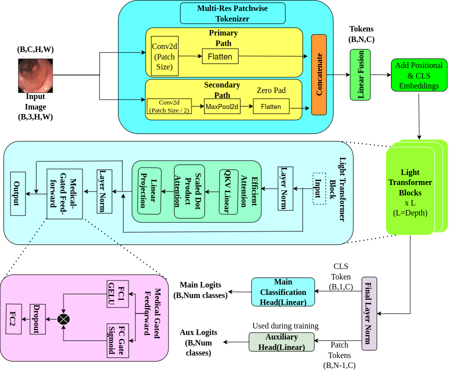

# LightGastroFormer

LightGastroFormer is a lightweight transformer-based architecture designed for gastrointestinal (GI) disease classification from endoscopic and capsule endoscopy images. The model combines a multi-resolution patchwise tokenizer, efficient self-attention, and a medical-gated feedforward network to capture both global contextual information and subtle lesion-level features while maintaining computational efficiency.

## Overview

Automated gastrointestinal disease classification plays an important role in assisting clinicians during endoscopic and capsule endoscopy examinations. Traditional CNN-based approaches often struggle with long-range dependencies, while standard Vision Transformers may overlook fine-grained lesion details and require substantial computational resources.

LightGastroFormer addresses these challenges through:

- Multi-resolution patchwise tokenization
- Lightweight transformer encoder
- Medical-gated feedforward network
- Auxiliary supervision head for stable optimization
- Efficient deployment with only 6.42M parameters

The architecture achieves strong performance on:

- Kvasir Capsule
- Kvasir v1
- Kvasir v2

without requiring explicit class balancing strategies.

<p align="center">
  
</p>

<p align="center">
  <em>Overview of the proposed LightGastroFormer architecture. The model combines a Multi-Resolution Patchwise Tokenizer, lightweight Transformer blocks, and a Medical-Gated Feedforward Network for efficient gastrointestinal disease classification.</em>
</p>

---

## Architecture

### Multi-Resolution Patchwise Tokenizer

The tokenizer extracts features at multiple spatial resolutions:

- Primary branch: coarse-grained global representations
- Secondary branch: fine-grained lesion-level representations

The resulting tokens are fused before being passed to the transformer encoder.

### Lightweight Transformer Encoder

The encoder consists of:

- Multi-head self-attention
- Layer normalization
- Residual connections
- Reduced embedding dimension for computational efficiency

### Medical-Gated Feedforward Network

A gated feedforward module selectively amplifies diagnostically relevant features while suppressing irrelevant activations.

### Auxiliary Supervision

An auxiliary classification head is used during training to improve optimization stability and minority-class performance.

---

## Repository Structure

```text
LightGastroFormer/
│
├── config.py          # Training and model configuration
├── dataset.py         # Dataset loading and preprocessing
├── engine.py          # Training and validation loops
├── model.py           # LightGastroFormer architecture
├── train.py           # Main training script
├── utils.py           # Utility functions
├── requirements.txt   # Dependencies
└── README.md
```

---

## Installation

Clone the repository:

```bash
git clone https://github.com/Prateeksingh-moa/LightGastroformer.git
cd LightGastroFormer
```

Create a virtual environment:

```bash
python -m venv lgf_env
source lgf_env/bin/activate
```

Install dependencies:

```bash
pip install -r requirements.txt
```

---

## Dataset Preparation

Organize your dataset as:

```text
dataset/
├── train/
│   ├── class_1/
│   ├── class_2/
│   └── ...
│
└── val/
    ├── class_1/
    ├── class_2/
    └── ...
```

Supported datasets include:

- Kvasir Capsule
- Kvasir v1
- Kvasir v2

Update dataset paths in `config.py` before training.

---

## Training

Run:

```bash
python train.py
```

Training parameters can be modified in:

```python
config.py
```

including:

- Learning rate
- Batch size
- Number of epochs
- Weight decay
- Transformer depth
- Embedding dimension

---

## Model Configuration

Default architecture:

| Parameter | Value |
|------------|---------|
| Input Resolution | 224 × 224 |
| Embedding Dimension | 256 |
| Transformer Depth | 6 |
| Attention Heads | 4 |
| Batch Size | 16 |
| Optimizer | AdamW |
| Scheduler | Cosine Annealing |
| Parameters | 6.42M |

---

## Results

### Kvasir Capsule

| Metric | Score |
|----------|--------|
| Accuracy | 0.97 |
| Macro F1 | 0.97 |
| Weighted F1 | 0.98 |

### Kvasir v1

| Metric | Score |
|----------|--------|
| Accuracy | 0.94 |
| F1 Score | 0.94 |

### Kvasir v2

| Metric | Score |
|----------|--------|
| Accuracy | 0.95 |
| F1 Score | 0.95 |

---

## Key Features

- Lightweight transformer architecture
- Multi-scale lesion representation learning
- Robust performance under severe class imbalance
- Computationally efficient deployment
- Suitable for real-time GI image analysis

---

## License

This project is released under the MIT License.

## Contact

Prateek Singh

For questions, issues, or collaborations, please open an issue or contact the authors.